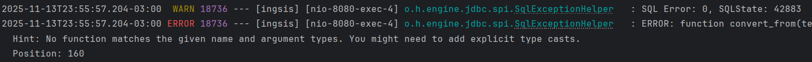

# snippet-service-Ingsis
Ejecutar para levantar:
- azurite local: docker run -p 10000:10000 -p 10001:10001 mcr.microsoft.com/azure-storage/azurite

- docker: docker-compose up 
- spring: ./gradlew bootRun
- builds: ./gradlew build
- formater; ./gradlew spotlessApply
- hooks: ./scripts/install-hooks.sh

Checkear:
- spotlessCheck: ./gradlew spotlessCheck

Instalar:
- azurite: npm install -g azurite

El Repositorio detecta Name (String guardado con formato Text) como si estuviera guardado en bytea y no se le puede hacer un LOWER(), asi que pateamos la query al service

